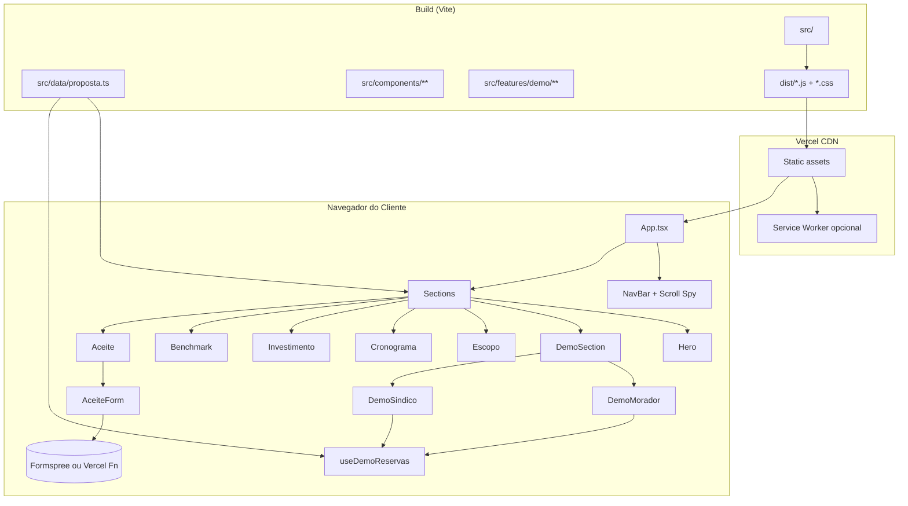
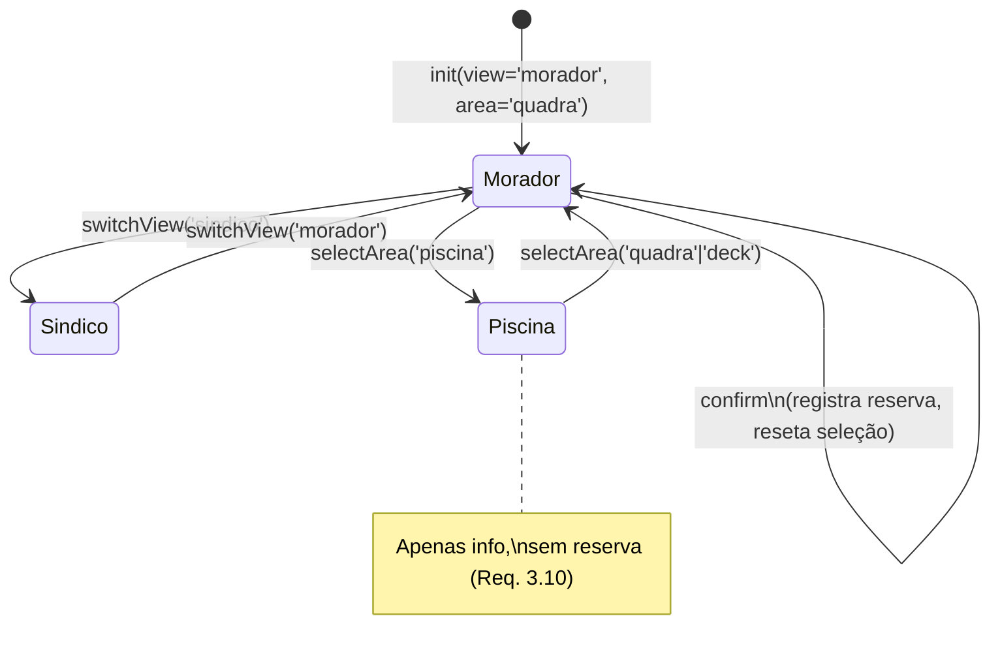

# Documento de Design — Apresentação Interativa de Vendas

## Overview

A Apresentacao é uma Single Page Application (SPA) estática em **React 18 + TypeScript + Vite + TailwindCSS 3**, hospedada via **Vercel** (ou Netlify como fallback — ambos atendem os NFRs e permitem funções serverless para o endpoint de aceite).

O produto entregue tem dois papéis funcionais que convivem numa mesma rota:

1. **Painel de vendas (conteúdo persuasivo)** — renderiza o conteúdo extraído de `Proposta_Comercial_App_Condominio.docx` como seções de uma landing page linear: Hero → Demo → Escopo → Cronograma → Investimento → Benchmarking → Diferenciais → Aceite.
2. **Demo interativa (MVP embutido)** — substitui o HTML monolítico `demo_app_condominio_digital.html` por componentes React isolados, corrigindo os 13 bugs listados na análise de requisitos. A Demo roda puramente in-memory; toda a lógica de reservas é encapsulada num hook `useDemoReservas` desacoplado da UI para permitir PBT.

A arquitetura é **content-driven**: todos os dados comerciais (valores, datas, escopo, cronograma) ficam em um módulo tipado `src/data/proposta.ts` — nenhum número ou texto comercial aparece hardcoded em JSX. Isso é o que permite aplicar a invariante de totalização (Requisito 2.10 / 12.4) como test-time assertion e recuperar o controle editorial do texto sem tocar em componentes.

A entrega final é um link HTTPS público (ex.: `https://ster-app-condominio.vercel.app`) com Open Graph configurado para compartilhamento em WhatsApp, e um **Modo Apresentador** acionado via querystring `?modo=apresentador` para guiar reuniões ao vivo (Req. 7).

### Decisões-chave e justificativas

| Decisão | Alternativa descartada | Justificativa |
| --- | --- | --- |
| Vite + React + TS | CRA, Next.js | Vite dá LCP ≤ 2,5s em site estático sem overhead de SSR; Next.js seria excesso para landing page estática. |
| TailwindCSS + tokens em `tailwind.config.js` | CSS Modules, styled-components | Req. 10 impõe Tailwind; tokens resolvem Bug #3 (vars CSS não declaradas). |
| Conteúdo em `proposta.ts` tipado | MDX, JSON solto | TypeScript dá autocomplete e invariante de totalização validável em build/test. MDX adicionaria loader sem benefício suficiente. |
| Estado da Demo via hook custom + `useReducer` | Zustand, Redux, Context global | Escopo da Demo é local e finito; reducer puro é trivialmente testável via PBT (fast-check). |
| Formulário de aceite via **Formspree** (ou Vercel Serverless Function) | Backend próprio | Requisito 6.3 pede "webhook, e-mail, Formspree ou equivalente"; Formspree zero-config atende sem infraestrutura adicional. |
| Deploy Vercel | Netlify, GitHub Pages | Todos atendem; Vercel tem preview deploys por PR e serverless functions nativas se Formspree precisar ser trocado. |
| `react-intersection-observer` para scroll-spy da nav | IntersectionObserver nativo | Lib pequena (<2KB) e encapsula casos de borda de thresholds. |

## Architecture

### Diagrama de alto nível



### Camadas

- **Apresentação (componentes React puros)**: recebem dados via props; nenhum componente faz fetch. Testáveis via React Testing Library.
- **Estado da Demo (`useDemoReservas`)**: hook que expõe `state + actions` derivados de um `reducer` puro `demoReducer(state, action)`. O reducer é importável isoladamente e é o alvo primário dos testes de propriedade.
- **Dados comerciais (`src/data/proposta.ts`)**: objeto literal imutável tipado. Inclui uma função `validarProposta()` que roda no teste de build e verifica invariantes (totalização, validade não expirada em relação a `hoje()`).
- **Integração externa**: único ponto de I/O é o POST do formulário de aceite. Tratado via `fetch` com `AbortController` e timeout de 10s.

### Fluxo de navegação e scroll-spy

1. A rota raiz renderiza uma página única com todas as seções em sequência (IDs: `hero`, `demo`, `escopo`, `cronograma`, `investimento`, `benchmarking`, `diferenciais`, `aceite`).
2. `NavBar` lê as seções do mesmo módulo `src/data/navegacao.ts` que define a ordem (Req. 1.1).
3. Scroll suave via `window.scrollTo({ behavior: 'smooth' })` ou `element.scrollIntoView({ behavior: 'smooth' })`, com **fallback não-suave** para usuários com `prefers-reduced-motion` (Req. 9).
4. A seção ativa é determinada via `IntersectionObserver` com threshold 0.4; a nav destaca o item correspondente (Req. 1.4).
5. Em viewport `< 768px`, a nav colapsa para um botão hambúrguer que abre um overlay full-screen (Req. 1.5).

### Fluxo da Demo



O reducer é puro e determinístico: mesmas entradas (state + action) produzem a mesma saída. Isso viabiliza fast-check para gerar sequências aleatórias de ações e verificar invariantes estruturais (Req. 12.2, 12.3, 12.6, 12.7).

### Modo Apresentador

- Lido uma única vez em `App.tsx` via `new URLSearchParams(location.search).get('modo') === 'apresentador'`.
- Exposto via `PresenterContext` para qualquer descendente ler sem prop-drilling.
- Keybindings registrados em `useEffect` global: `ArrowRight`/`PageDown` avança, `ArrowLeft`/`PageUp` volta, `Esc` retorna ao hero.
- Notas do apresentador vêm do mesmo `navegacao.ts` (cada seção tem campo `notasApresentador?: string`) e renderizam apenas quando `presenterMode === true`.

### Hospedagem

- **Build**: `vite build` gera `dist/` com HTML + JS + CSS + assets em `dist/assets/`.
- **Deploy**: `vercel --prod` (ou push em branch `main` com conector Git). Tempo de build: ~30s.
- **Domínio**: subdomínio `.vercel.app` é suficiente para o MVP; domínio custom opcional.
- **Cache headers**: `Cache-Control: public, max-age=31536000, immutable` para `dist/assets/*` (filenames com hash); `no-cache` para `index.html`.
- **PDF da Proposta**: arquivo estático em `public/proposta-app-condominio.pdf`, gerado manualmente a partir do `.docx` no primeiro build (Premissa 7 de requirements).

## Components and Interfaces

### Árvore de componentes

```
App
├─ PresenterProvider
├─ Layout
│  ├─ NavBar (desktop) / NavBarMobile (< 768px)
│  ├─ CTAFloating            (Req. 4.5)
│  ├─ ScrollReminderToast    (Req. 4.6)
│  └─ Footer
├─ main
│  ├─ Hero                   (Req. 4.1)
│  ├─ DemoSection            (Req. 3)
│  │  ├─ DemoTabs
│  │  ├─ DemoMorador
│  │  │  ├─ MobileMockup
│  │  │  │  ├─ AreaCard × N
│  │  │  │  ├─ SlotGrid
│  │  │  │  ├─ ConfirmButton
│  │  │  │  └─ ConfirmMessage
│  │  │  └─ TimelineProximas
│  │  └─ DemoSindico
│  │     ├─ KpiGrid
│  │     ├─ MapaOcupacao
│  │     ├─ AcoesRapidas     (substitui sendPrompt)
│  │     └─ UltimasReservas
│  ├─ EscopoSection          (Req. 2.2)
│  ├─ CronogramaSection      (Req. 2.3)
│  ├─ InvestimentoSection    (Req. 2.4-2.7)
│  │  └─ ValidadeBadge       (Req. 4.8)
│  ├─ BenchmarkSection       (Req. 5)
│  ├─ DiferenciaisSection    (Req. 4.7)
│  └─ AceiteSection          (Req. 6)
│     └─ AceiteForm
└─ PresenterControls         (renderiza só em modo=apresentador)
```

### Contratos principais

#### `useDemoReservas`

```ts
// src/features/demo/useDemoReservas.ts
export type AreaId = 'quadra' | 'deck' | 'piscina';
export type Slot = `${number}${number}:${number}${number}`; // "HH:MM"

export interface AreaConfig {
  readonly id: AreaId;
  readonly nome: string;
  readonly fechamentoDiaUtil: Slot;      // ex. "22:00"
  readonly fechamentoFimDeSemana: Slot;  // ex. "00:00" (meia-noite)
  readonly duracaoMaxHoras: number;      // 2 para quadra
  readonly reservavel: boolean;          // false para piscina (Req. 3.10)
  readonly slotsBase: readonly Slot[];
}

export interface DemoState {
  readonly view: 'morador' | 'sindico';
  readonly areaSelecionada: AreaId;
  readonly slotSelecionado: Slot | null;
  readonly reservasPorArea: Readonly<Record<AreaId, readonly Slot[]>>;
  readonly ultimaConfirmacao: { area: AreaId; slot: Slot; fim: Slot } | null;
}

export type DemoAction =
  | { type: 'SWITCH_VIEW'; view: 'morador' | 'sindico' }
  | { type: 'SELECT_AREA'; area: AreaId }
  | { type: 'SELECT_SLOT'; slot: Slot }
  | { type: 'CONFIRM' }
  | { type: 'RESET' };

export function demoReducer(state: DemoState, action: DemoAction): DemoState;

export function useDemoReservas(initial?: Partial<DemoState>): {
  state: DemoState;
  dispatch: React.Dispatch<DemoAction>;
  // derived
  slotsComStatus: ReadonlyArray<{ slot: Slot; status: 'livre' | 'ocupado' | 'fora-do-expediente' }>;
  fimDaReservaSelecionada: Slot | null;
  podeConfirmar: boolean;
};
```

Propriedades exportadas do reducer (puro) permitem testar invariantes do Requisito 12 sem montar nenhum componente React.

#### `AceiteForm`

```ts
// src/features/aceite/AceiteForm.tsx
export interface AceiteFormData {
  nome: string;
  documento: string;   // CPF ou CNPJ, validado por regex
  email: string;
  telefone: string;
  aceitouTermos: boolean;
}

export type AceiteStatus =
  | { kind: 'idle' }
  | { kind: 'submitting' }
  | { kind: 'success'; at: Date }
  | { kind: 'error'; message: string };

export interface AceiteFormProps {
  endpoint: string;                      // URL do Formspree / Vercel Fn
  onSuccess?: (data: AceiteFormData) => void;
}
```

Validação client-side via [zod](https://zod.dev/) schema; feedback campo-a-campo (Req. 6.4).

#### `PresenterContext`

```ts
export interface PresenterContextValue {
  readonly active: boolean;
  readonly currentSectionIndex: number;
  goToSection(index: number): void;
  copyShareLink(): Promise<void>;
}
```

#### NavBar

```ts
export interface NavItem {
  id: string;                         // âncora (#hero, #demo, ...)
  label: string;                      // "Demo", "Investimento", ...
  notasApresentador?: string;
}

export interface NavBarProps {
  items: readonly NavItem[];
  activeId: string;
  onNavigate?(id: string): void;
}
```

### Substituição de `sendPrompt`

Os 4 botões do HTML original que chamavam `sendPrompt(...)` serão substituídos por:

| Botão original | Substituto React |
| --- | --- |
| "Ver fluxo completo do morador" | `<DialogoFluxoMorador />` — modal com screenshots/wireframes estáticos |
| "Bloquear área para manutenção" | `<TooltipFeature texto="..." />` — tooltip explicativo; sem ação mutável |
| "Alterar horários de funcionamento" | `<TooltipFeature ... />` |
| "Exportar relatório mensal" | `<TooltipFeature ... />` |
| "Detalhes técnicos" | `<DialogoArquiteturaBackend />` com texto sobre concorrência/lock otimista |

## Data Models

### `src/data/proposta.ts`

```ts
export interface Proposta {
  readonly cabecalho: {
    readonly cliente: string;
    readonly desenvolvedor: string;
    readonly dataEmissao: string;      // ISO 8601, ex. "2026-05-05"
    readonly validadeDias: number;     // 30
  };
  readonly sumarioExecutivo: {
    readonly unidades: number;         // 520
    readonly semanas: number;          // 10
    readonly plataformas: readonly string[]; // ['iOS', 'Android']
    readonly destaque: string;         // "MVP em uso real a partir da Semana 7"
  };
  readonly escopo: readonly AreaEscopo[];
  readonly cronograma: readonly FaseCronograma[];
  readonly investimento: {
    readonly itens: readonly ItemInvestimento[];
    readonly totalCentavos: number;    // 3_350_000
    readonly mensalidadeCentavos: number; // 115_000
    readonly itensMensalidade: readonly string[];
    readonly condicoesPagamento: {
      readonly entradaPct: number;     // 50
      readonly saldoPct: number;       // 50
      readonly formas: readonly string[]; // ['PIX', 'Boleto', 'Transferência']
    };
    readonly garantiaDias: number;     // 90
  };
  readonly diferenciais: readonly string[];
  readonly contato: {
    readonly whatsappNumero: string;   // "+55..."
    readonly email: string;
  };
}

export interface AreaEscopo {
  readonly nome: string;               // "Quadra de Vôlei"
  readonly horarioDiaUtil: string;     // "08h – 22h"
  readonly horarioFimDeSemana: string;
  readonly regraPrincipal: string;     // "Limite 2h por casa"
}

export interface FaseCronograma {
  readonly fase: number;               // 1..4
  readonly semanas: string;            // "1–2"
  readonly atividades: readonly string[];
  readonly entregaveis: readonly string[];
}

export interface ItemInvestimento {
  readonly descricao: string;
  readonly valorCentavos: number;
}

export const proposta: Proposta;

// Helpers
export function formatarMoeda(centavos: number): string; // "R$ 15.000,00"
export function parseMoeda(formatado: string): number;   // centavos
export function diasRestantes(proposta: Proposta, hoje: Date): number;
export function validarProposta(p: Proposta): void;      // throws on invariant violation
```

`validarProposta` roda:
- No **test setup** (Vitest) para garantir que qualquer PR que altere valores mantém `soma(itens) === totalCentavos`.
- Opcionalmente no **build** via script `scripts/validate-proposta.ts` executado pelo `prebuild` do `package.json`, para falhar o deploy em caso de inconsistência.

### `src/data/demoConfig.ts`

```ts
import type { AreaConfig } from '../features/demo/useDemoReservas';

export const AREAS: Readonly<Record<AreaId, AreaConfig>>;

export const KPIS_SINDICO: readonly {
  label: string;
  valor: string;
  delta?: string;
  tom: 'positivo' | 'neutro';
}[];

export const ACOES_RAPIDAS_SINDICO: readonly {
  titulo: string;
  descricao: string;                   // texto para o tooltip/modal
}[];

export const ULTIMAS_RESERVAS_MOCK: readonly {
  casa: string;
  area: string;
  tempoRelativo: string;
}[];
```

### `src/data/benchmark.ts`

```ts
export interface LinhaBenchmark {
  readonly opcao: string;              // "Esta proposta (Lavita)" | "SaaS white-label" | "Dev customizado Sudeste" | "Concorrente regional"
  readonly custoInicial: string;       // "R$ 33.500" | "R$ 0" | "R$ 80.000+" | ...
  readonly custoMensal: string;
  readonly prazoEntrega: string;
  readonly propriedadeCodigo: 'Sim' | 'Não' | 'Parcial';
  readonly customizacao: 'Total' | 'Limitada' | 'Alta';
}

export const BENCHMARK: readonly LinhaBenchmark[];
export const FONTES_BENCHMARK: readonly string[]; // rodapé (Req. 5.3)
```

### `src/data/navegacao.ts`

```ts
export interface SecaoNav {
  readonly id: string;
  readonly label: string;
  readonly notasApresentador?: string;
}

export const SECOES: readonly SecaoNav[] = [
  { id: 'hero', label: 'Início' },
  { id: 'demo', label: 'Demonstração', notasApresentador: '...' },
  // ...
];
```

## Correctness Properties

_A property is a characteristic or behavior that should hold true across all valid executions of a system — essentially, a formal statement about what the system should do. Properties serve as the bridge between human-readable specifications and machine-verifiable correctness guarantees._

### Aplicabilidade de PBT

PBT é apropriado para esta feature porque a camada de lógica de negócio é composta por **funções puras e um reducer determinístico** (`demoReducer`, `formatarMoeda`/`parseMoeda`, `validarProposta`, validação de slots). Esses módulos têm input/output bem definidos e invariantes universais (idempotência, round-trip, particionamento). A camada puramente visual (scroll suave, outline de foco, Open Graph, responsividade visual) será testada com unit tests exemplares + snapshot + visual/manual review, conforme descrito em Testing Strategy.

### Property 1: Totalização do investimento

*For all* propostas `p` definidas em `proposta.ts`, a soma dos valores de `p.investimento.itens` SHALL ser exatamente igual a `p.investimento.totalCentavos`, e a soma de `entrada + saldo` (derivada de `condicoesPagamento` + `totalCentavos`) SHALL também igualar `totalCentavos`.

**Validates: Requirements 2.4, 2.6, 2.10, 12.4**

### Property 2: Round-trip de formatação monetária

*For all* valores inteiros `c` em centavos (`0 ≤ c ≤ 10^11`), `parseMoeda(formatarMoeda(c)) === c`.

**Validates: Requirements 2.8, 12.8**

### Property 3: Não-duplicidade de reserva

*For all* estados iniciais válidos `s₀` da Demo e *for all* sequências finitas de ações `[a₁, ..., aₙ]` aplicadas via `demoReducer`, o número de ocorrências de qualquer slot em `state.reservasPorArea[area]` SHALL ser no máximo 1 para toda `area`.

**Validates: Requirements 3.7, 11.5, 12.2, 12.7** (engloba idempotência de `CONFIRM` e bloqueio de slots ocupados)

### Property 4: Particionamento dos slots por área

*For all* estados `s` da Demo e *for all* `area ∈ AreaId`, os conjuntos `slotsLivres(s, area)`, `slotsOcupados(s, area)` e `slotsForaDoExpediente(s, area)` SHALL ser disjuntos dois-a-dois e sua união SHALL ser igual a `AREAS[area].slotsBase`.

**Validates: Requirements 12.3**

### Property 5: Respeito ao horário de fechamento

*For all* `area ∈ AreaId` onde `area.reservavel === true` e *for all* `slot ∈ AREAS[area].slotsBase`, se `somarHoras(slot, area.duracaoMaxHoras) > area.fechamentoDiaUtil` (para dias úteis), então o status derivado daquele slot SHALL ser `'fora-do-expediente'` e nenhuma sequência de ações via `demoReducer` SHALL resultar em `slot ∈ state.reservasPorArea[area]`.

**Validates: Requirements 3.8, 11.5, 12.6** (corrige bug original onde 21:00 gerava reserva até 23:00)

### Property 6: Isolamento de estado por área

*For all* pares de áreas distintas `(a₁, a₂)` com `a₁ ≠ a₂` e *for all* sequências de ações aplicadas com `state.areaSelecionada = a₁`, o conjunto `state.reservasPorArea[a₂]` SHALL permanecer inalterado em relação ao estado inicial.

**Validates: Requirements 3.9, 11.5** (corrige bug do HTML original onde `state.bookedSlots` era compartilhado entre áreas)

### Property 7: Preservação de estado ao alternar aba Morador ↔ Síndico

*For all* estados `s` da Demo e *for all* pares consecutivos de ações `SWITCH_VIEW('sindico'); SWITCH_VIEW('morador')`, os campos `areaSelecionada`, `slotSelecionado` e `reservasPorArea` de `s` SHALL ser idênticos antes e depois da alternância.

**Validates: Requirements 12.9, 3.2**

### Property 8: Piscina não é reservável

*For all* sequências de ações aplicadas enquanto `state.areaSelecionada === 'piscina'`, `state.reservasPorArea['piscina']` SHALL permanecer vazio e `state.ultimaConfirmacao` SHALL ser `null` ou referir-se a uma área diferente de `'piscina'`.

**Validates: Requirements 3.10, 11.5**

### Property 9: Consistência de roteamento da navegação

*For all* itens `item ∈ SECOES`, SHALL existir no DOM renderizado um elemento com `id === item.id`. (Propriedade verificável via teste de integração que renderiza `<App />` e checa `document.getElementById(item.id)` para cada item.)

**Validates: Requirements 1.3, 12.1**

### Property 10: Validade monotônica

*For all* data `d` tal que `d > proposta.cabecalho.dataEmissao + proposta.cabecalho.validadeDias`, `diasRestantes(proposta, d) ≤ 0`; e *for all* `d` tal que `d < dataEmissao`, `diasRestantes(proposta, d) ≥ validadeDias`.

**Validates: Requirements 4.8** (cronômetro de validade no bloco de investimento)

## Error Handling

| Fonte de erro | Tratamento |
| --- | --- |
| Falha no POST do formulário de aceite (rede, 5xx, timeout) | `AceiteForm` entra em estado `{ kind: 'error', message }` e exibe banner vermelho dentro do próprio formulário com CTA "Tentar novamente" e CTA secundário "Falar no WhatsApp". Dados digitados são preservados no state. |
| Validação de campos (zod) | Cada campo mostra `aria-invalid="true"` e mensagem específica abaixo do input (Req. 6.4). Submissão bloqueada até todos os campos passarem. |
| Ação inválida no `demoReducer` (ex.: `SELECT_SLOT` com slot fora do expediente) | Reducer retorna o mesmo state (no-op). Não lança. A UI simplesmente não reflete a mudança. Isso é o que permite a Property 3 e a Property 8. |
| `validarProposta` falha no build | `scripts/validate-proposta.ts` sai com código ≠ 0 e imprime o item violado. Vercel falha o deploy. |
| URL com `?modo=apresentador` mas usuário anônimo | Nenhum efeito colateral; apresentação continua funcional, apenas com controles extras. Sem autenticação por design (Req. 8.3). |
| Service Worker falha no registro (Req. 8.4) | Silenciado via `.catch(() => {})`; degradação graciosa para modo online-only. Não impede o primeiro load. |
| Usuário em browser antigo sem `IntersectionObserver` | Scroll-spy cai no fallback `scroll` event com debounce 100ms. `prefers-reduced-motion` respeitado. |
| `navigator.clipboard` indisponível (HTTP ou navegador antigo) no botão "Copiar link" | Fallback cria `<textarea>` temporário e usa `document.execCommand('copy')`. |
| Download do PDF falha (404) | Link usa `<a download href="/proposta-app-condominio.pdf">`; caso missing, exibe toast "PDF indisponível — baixe o .docx" com link alternativo. |
| Campo `endpoint` do Formspree não configurado | Em dev mostra banner amarelo; em produção, botão "Aceitar proposta" colapsa graciosamente para "Falar no WhatsApp" como fallback. |

## Testing Strategy

### Ferramentas

| Camada | Ferramenta | Observações |
| --- | --- | --- |
| Unit + integration | **Vitest** (Jest-compatível, nativo Vite) | Test runner único; `jsdom` environment para componentes. |
| Property-based testing | **fast-check** | Library PBT padrão do ecossistema JS/TS. 100+ iterações mínimas por property (Req. 12). |
| Component testing | **React Testing Library** | Queries por role/label, sem snapshots frágeis. |
| E2E opcional | **Playwright** | Só para smoke dos fluxos de navegação e submissão (1–2 testes). |
| Acessibilidade | **axe-core** (`@axe-core/react`) | Roda em dev e em testes de integração. |
| Lighthouse CI | GitHub Action | Valida LCP ≤ 2,5s (Req. 8.2) em PRs. |

### Organização

```
src/
├─ data/
│  └─ __tests__/
│     ├─ proposta.test.ts          # unit + property (P1, P2, P10)
│     ├─ formatarMoeda.pbt.test.ts # fast-check (P2)
│     └─ benchmark.test.ts         # snapshot + schema
├─ features/
│  └─ demo/
│     ├─ demoReducer.ts
│     ├─ useDemoReservas.ts
│     └─ __tests__/
│        ├─ demoReducer.test.ts      # unit (examples)
│        ├─ demoReducer.pbt.test.ts  # fast-check (P3, P4, P5, P6, P7, P8)
│        └─ MobileMockup.test.tsx    # RTL
├─ features/aceite/
│  └─ __tests__/
│     ├─ AceiteForm.test.tsx         # RTL + mock fetch
│     └─ zodSchema.test.ts           # unit
└─ components/
   └─ __tests__/
      ├─ NavBar.test.tsx             # RTL
      └─ App.integration.test.tsx    # renderiza tudo, valida Property 9
```

### Mapa Property → Test file

| Property | Arquivo de teste | Técnica |
| --- | --- | --- |
| P1 Totalização | `proposta.test.ts` | Example + `validarProposta` |
| P2 Round-trip moeda | `formatarMoeda.pbt.test.ts` | fast-check, 1000 iter, `fc.integer({min:0, max:1e11})` |
| P3 Não-duplicidade | `demoReducer.pbt.test.ts` | fast-check, gera sequência aleatória de ações via `fc.array(acoes)` |
| P4 Particionamento | `demoReducer.pbt.test.ts` | fast-check, invariante após cada action |
| P5 Horário fechamento | `demoReducer.pbt.test.ts` | fast-check, verifica set `reservasPorArea` ⊆ slots válidos |
| P6 Isolamento entre áreas | `demoReducer.pbt.test.ts` | fast-check, model-based testing |
| P7 Preservação ao alternar | `demoReducer.pbt.test.ts` | fast-check, para todo state, toggle×2 === identity |
| P8 Piscina não-reservável | `demoReducer.pbt.test.ts` | fast-check, sequência forçada com piscina |
| P9 Roteamento consistente | `App.integration.test.tsx` | unit example (conjunto finito de SECOES) |
| P10 Validade | `proposta.test.ts` | fast-check, `fc.date()` |

### Tags e convenções para PBT

Cada property test SHALL incluir um comentário no topo no formato:

```ts
// Feature: apresentacao-interativa-vendas, Property 3: Não-duplicidade de reserva
// *For all* estados iniciais válidos s₀ e sequências de ações, nenhum slot aparece mais de uma vez em reservasPorArea[area].
test.prop([demoStateArb, actionSequenceArb])(
  'não-duplicidade de reserva',
  (s0, actions) => {
    const final = actions.reduce(demoReducer, s0);
    for (const area of AREAS_ARR) {
      const reservas = final.reservasPorArea[area];
      expect(new Set(reservas).size).toBe(reservas.length);
    }
  },
  { numRuns: 200 },
);
```

### Testes não-PBT (unit e integração)

Mantemos unit tests exemplares para:

- **CTAs e conversão (Req. 4.1, 4.5, 6.1)**: smoke de que os botões existem, têm `aria-label` e disparam `onClick`.
- **Responsividade (Req. 9.1)**: 4 snapshots visuais em 320/768/1024/1440 via Playwright screenshots; revisão manual.
- **Acessibilidade (Req. 9.2–9.6)**: axe-core no `App.integration.test.tsx` falha em issues level `serious` ou `critical`.
- **Modo Apresentador (Req. 7)**: unit test simula `URLSearchParams` e valida renderização condicional de controles e notas.
- **Aceite form (Req. 6.3, 6.4)**: RTL monta `<AceiteForm endpoint={mock} />`, valida fluxos válido/inválido e mock de `fetch`.
- **Benchmark (Req. 5)**: snapshot test da tabela + verificação textual das fontes no rodapé.

### Mínimo de iterações e tags

- `numRuns: 100` é o mínimo em PBT (Req. 12). Para propriedades com espaço de busca pequeno (ex.: P7), usar `numRuns: 100`. Para as mais abrangentes (P3, P5), usar `numRuns: 200`.
- Shrinking ativo em todos os property tests (comportamento padrão do fast-check).
- `fc.pre(...)` usado para descartar rapidamente sequências onde o invariante não se aplica (ex.: sequência sem nenhum `CONFIRM`).

### CI

GitHub Actions workflow executa, em PR e em push para `main`:

1. `pnpm install`
2. `pnpm typecheck`
3. `pnpm lint`
4. `pnpm test --run --coverage` (Vitest + fast-check)
5. `pnpm build` (inclui `prebuild` = `validate-proposta.ts`)
6. Lighthouse CI em preview deploy do Vercel.
